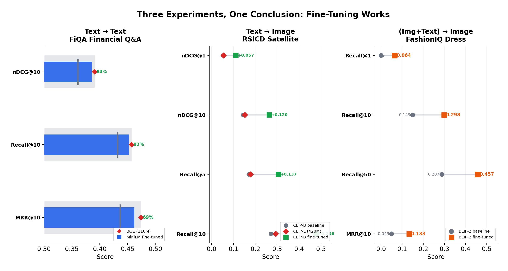
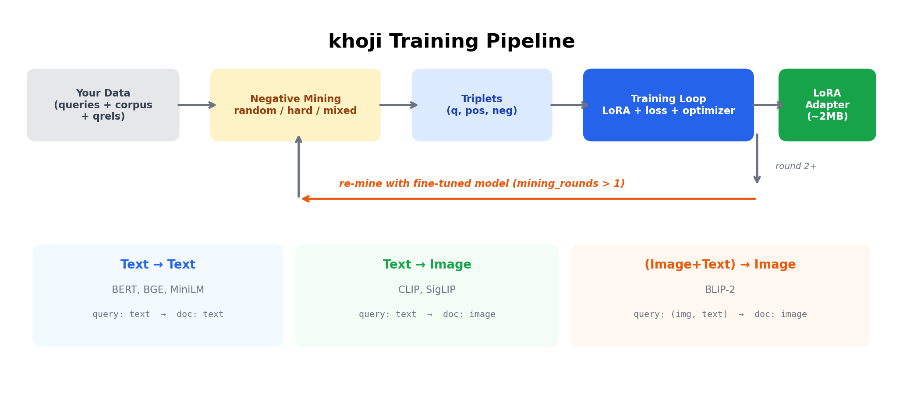
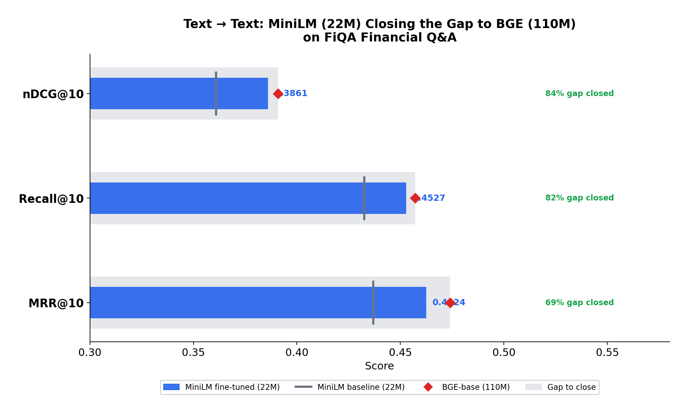
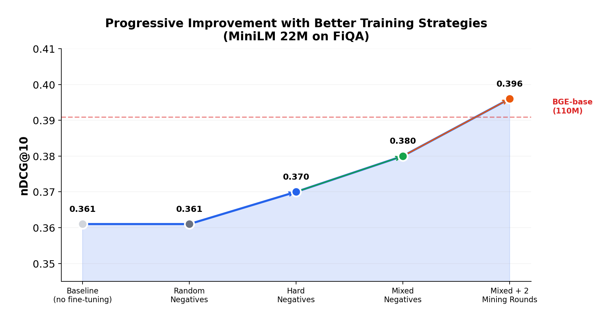
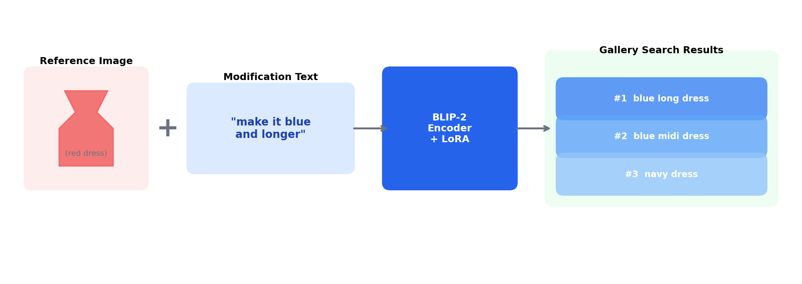
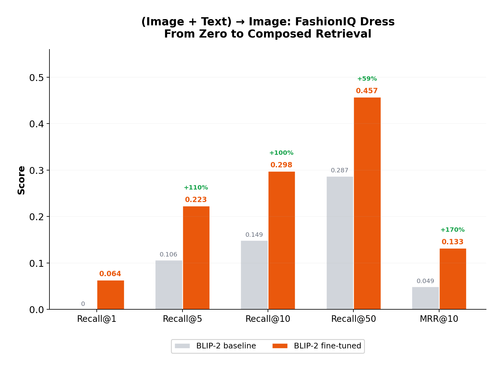
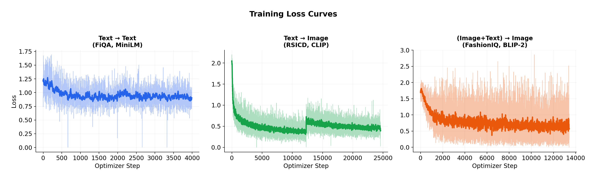

# Fine-Tuning Retrieval Models for Your Domain: A Practical Guide with khoji

*How a 5x smaller model can match a larger one on your data — and why that matters for RAG, search, and recommendations.*

---

## The Problem: Pretrained Models Are Generalists

If you're building a RAG pipeline, a search engine, or a recommendation system, you're probably using a pretrained embedding model — something like BGE, MiniLM, or CLIP. These models are trained on massive web corpora and work surprisingly well out of the box.

Until they don't.

Ask BGE to rank financial documents by relevance to a compliance query, and it does okay. Ask it to distinguish between two subtly different regulatory filings, and it starts to struggle. Ask CLIP to find satellite images matching a text description, and it falls flat — it's never seen satellite imagery during training. Ask BLIP-2 to find "this dress but in red," and it has no idea what you mean.

The issue isn't the architecture. It's the training data. These models learned representations from generic web text and images. Your domain — legal, medical, financial, satellite, fashion — has its own vocabulary, its own notion of relevance, and its own patterns that the pretrained model never saw.

The fix is fine-tuning. But fine-tuning a retrieval model is different from fine-tuning a classifier. You don't have labeled classes — you have queries, a corpus, and relevance judgments. You need triplets, negative mining, specialized loss functions, and evaluation metrics that most training frameworks don't handle natively.

That's what [khoji](https://github.com/suyashh94/khoji) is for. We ran three experiments across text search, image search, and composed retrieval — here's the summary before we dive in:



In every case, a smaller fine-tuned model matched or surpassed a larger general-purpose one. Let's see how.

---

## How khoji Works

Before diving into experiments, here's the pipeline at a glance:



The flow is the same across all three retrieval modes:

1. **Your data** (queries + corpus + relevance judgments) goes in
2. **Negative mining** selects non-relevant items as training signal — randomly, by model similarity (hard), or both (mixed)
3. **Triplets** (query, positive, negative) are constructed
4. **Training** applies LoRA to the base model, optimizes with your chosen loss function, and saves a ~2MB adapter
5. Optionally, **mining rounds** repeat steps 2-4 using the fine-tuned model to find progressively harder negatives

The library supports three retrieval modes — text-to-text, text-to-image, and composed (image+text to image) — each with the same pipeline structure but different model architectures underneath.

---

## Experiment 1: Text → Text on Financial Q&A

### The Setup

**Question:** Can a small, fast model match a much larger one if you fine-tune it on domain data?

We use two models on [FiQA](https://sites.google.com/view/fiqa/) — a financial question-answering dataset with 648 test queries over 57K documents:

| Model | Parameters | Role |
|-------|-----------|------|
| `BAAI/bge-base-en-v1.5` | 110M | The "big" reference model (no fine-tuning) |
| `sentence-transformers/all-MiniLM-L6-v2` | 22M | The small model we fine-tune |

MiniLM is 5x smaller than BGE. Out of the box, it underperforms. Let's see if fine-tuning can close that gap.

### The Results



| Model | nDCG@10 | Recall@10 | MRR@10 |
|-------|---------|-----------|--------|
| BGE-base (110M, no fine-tuning) | 0.3909 | 0.4572 | 0.4740 |
| MiniLM (22M, no fine-tuning) | 0.3610 | 0.4325 | 0.4369 |
| **MiniLM (22M, fine-tuned)** | **0.3861** | **0.4527** | **0.4624** |

The fine-tuned MiniLM closed **84% of the nDCG@10 gap** to the 5x larger BGE model. The remaining gap is just 0.005 — effectively within noise for most applications.

What does this mean in practice? You can deploy a model that's 5x smaller, 5x faster at inference, and 5x cheaper to host — with nearly identical retrieval quality on your domain.

### The Code

The entire training config fits in a YAML file:

```yaml
model:
  name: sentence-transformers/all-MiniLM-L6-v2

data:
  dataset: fiqa
  split: train
  negatives: mixed        # combine random + hard negatives
  n_random: 2
  n_hard: 1
  mining_rounds: 2        # re-mine with fine-tuned model after round 1

lora:
  r: 16
  alpha: 32
  dropout: 0.1

train:
  epochs: 3
  batch_size: 16
  grad_accum_steps: 4
  lr: 2e-5
  warmup_steps: 50
  loss: infonce
  temperature: 0.05

eval:
  k_values: [1, 5, 10]
  run_before: true
  run_after: true

output_dir: ./output/text-retrieval
```

And two lines of Python to run it:

```python
from khoji import ForgeConfig, run

config = ForgeConfig.from_yaml("fiqa_config.yaml")
result = run(config)
```

That's it. khoji handles loading the dataset, mining negatives, applying LoRA, training with gradient accumulation, evaluating before and after, and saving the adapter.

The LoRA adapter is ~2MB. The base MiniLM model stays frozen. At inference time:

```python
from khoji import EmbeddingModel

model = EmbeddingModel(
    "sentence-transformers/all-MiniLM-L6-v2",
    adapter_path="./output/text-retrieval/adapter"
)
embeddings = model.encode(["What is compound interest?"])
```

### Why Mixed Negatives and Mining Rounds Matter



The config uses two techniques that deserve explanation.

**Mixed negatives** combine two types of training signal:

- **Random negatives** are items sampled randomly from the corpus. They're easy for the model — clearly irrelevant — but they teach basic discrimination. *"This financial document is not about cooking recipes."*
- **Hard negatives** are items the model currently ranks highly but that aren't actually relevant. They're mined by encoding the entire corpus, finding the top-k most similar non-relevant items for each query, and using those as negatives. They force fine-grained distinctions. *"This document about bond yields is not the same as this document about bond ratings."*

Using both together gives the most balanced signal. Random negatives prevent collapse; hard negatives push the ranking boundary.

**Mining rounds** take this further. After the first round of training, the model has improved — what was "hard" before may now be easy. So we re-mine: encode the corpus with the fine-tuned model, find new hard negatives, and train again. The learning rate is automatically halved each round to avoid overshooting.

```
Round 1: pretrained model → mine negatives → train → adapter_r1
Round 2: adapter_r1 → re-mine harder negatives → train → final adapter
```

---

## Experiment 2: Text → Image on Satellite Imagery

### The Setup

**Question:** Can fine-tuning help a vision-language model understand a visual domain it was never trained on?

CLIP models are trained on internet image-text pairs — photos, illustrations, memes. They've never seen satellite or aerial imagery. We test on [RSICD](https://github.com/201528014227051/RSICD_optimal) — ~10K satellite images with captions like *"an airport with multiple runways"* or *"a river flowing through farmland."*

| Model | Parameters | Role |
|-------|-----------|------|
| `openai/clip-vit-large-patch14` | 428M | The "big" CLIP (no fine-tuning) |
| `openai/clip-vit-base-patch32` | 151M | The small CLIP we fine-tune |

### The Results


| Model | nDCG@10 | Recall@10 |
|-------|---------|-----------|
| CLIP ViT-L/14 (428M, no fine-tuning) | 0.1522 | 0.2937 |
| CLIP ViT-B/32 (151M, no fine-tuning) | 0.1439 | 0.2715 |
| **CLIP ViT-B/32 (151M, fine-tuned)** | **0.2639** | **0.4776** |

The fine-tuned small CLIP doesn't just match the large one — it **surpasses it by 73% on nDCG@10**. Recall@10 goes from 0.27 to 0.48 — nearly doubling the number of relevant satellite images found in the top 10.

This is the clearest case for domain-specific fine-tuning. Neither CLIP model was trained on satellite imagery. The large model has more capacity but no relevant knowledge. Fine-tuning on a few thousand domain examples gives the small model knowledge the large model simply doesn't have.

### The Code

```yaml
model:
  name: openai/clip-vit-base-patch32
  lora_target: both          # fine-tune both vision and text encoders

data:
  dataset: arampacha/rsicd
  split: train
  negatives: mixed
  n_random: 2
  n_hard: 1
  top_k: 50
  skip_top: 5               # skip likely false negatives
  mining_rounds: 2

lora:
  r: 16
  alpha: 32

train:
  epochs: 3
  batch_size: 16
  grad_accum_steps: 2
  lr: 2e-5
  loss: infonce
  temperature: 0.05

eval:
  k_values: [1, 5, 10]
  run_before: true
  run_after: true

output_dir: ./output/multimodal-retrieval
```

```python
from khoji import MultimodalForgeConfig, run_multimodal

config = MultimodalForgeConfig.from_yaml("rsicd_config.yaml")
result = run_multimodal(config)
```

### Why `skip_top` Matters for Domain-Specific Data

Notice `skip_top: 5` in the config. This is critical for datasets with incomplete relevance labels.

RSICD has ~10K satellite images, many of which look very similar — multiple airport images, multiple river images. The relevance labels only mark one or two as "relevant" per query, but there could be dozens of equally valid matches that weren't labeled.

When we mine hard negatives, the model's top-ranked "non-relevant" results are often actually relevant images that the annotator missed. Training the model to push these away is counterproductive — we'd be teaching it to rank good results lower.

`skip_top: 5` skips the 5 most similar non-relevant items and picks hard negatives starting from rank 6. This avoids training on likely false negatives while still getting genuinely hard examples.

### LoRA Targeting for Multimodal Models

For CLIP/SigLIP models, you can choose which encoder to fine-tune:

| `lora_target` | What it does | When to use |
|---------------|-------------|-------------|
| `both` | Fine-tunes text AND vision encoders | General domain adaptation (our case) |
| `vision` | Vision encoder only | Text queries are fine, images are domain-specific |
| `text` | Text encoder only | Images are generic, queries use domain jargon |

For satellite imagery, `both` makes sense — the model needs to learn both what satellite images look like and how text descriptions map to those visual features.

---

## Experiment 3: Composed Image Retrieval on Fashion

### The Concept



Composed image retrieval is the most complex mode. The query is a **pair**: a reference image and a modification caption. *"Here's a red dress — find me one that's similar but in blue and longer."* The model must understand both the visual reference and the textual modification, then retrieve the right target from a gallery.

### The Setup

We use [FashionIQ](https://github.com/XiaoxiaoGuo/fashion-iq) (dress category) with `Salesforce/blip2-itm-vit-g` — a BLIP-2 joint image-text encoder.

Unlike the previous experiments, there's no "large model" reference here. The question is whether BLIP-2 can learn composed retrieval with fine-tuning at all.

### The Results



| Model | Recall@1 | Recall@10 | Recall@50 | MRR@10 |
|-------|---------|-----------|-----------|--------|
| BLIP-2 (no fine-tuning) | 0.0000 | 0.1489 | 0.2872 | 0.0491 |
| **BLIP-2 (fine-tuned)** | **0.0638** | **0.2979** | **0.4574** | **0.1325** |

The pretrained BLIP-2 can't get a single Recall@1 hit — it has no concept of "find this but different." After fine-tuning, **Recall@10 doubles** from 15% to 30%, and Recall@50 jumps from 29% to 46%.

This is a case where fine-tuning doesn't just improve performance — it **enables an entirely new capability**.

### The Code

For composed retrieval, the dataset format is different — each query is an (image, text) pair:

```python
from khoji import ComposedRetrievalDataset

dataset = ComposedRetrievalDataset(
    queries={
        "q1": ("imgs/ref_dress.jpg", "make it red and shorter"),
        "q2": ("imgs/ref_shirt.jpg", "longer sleeves"),
    },
    corpus={
        "d1": "imgs/red_dress.jpg",
        "d2": "imgs/long_sleeve_shirt.jpg",
        "d3": "imgs/other.jpg",
    },
    qrels={"q1": {"d1": 1}, "q2": {"d2": 1}},
)
```

Training follows the same pattern:

```python
from khoji import (
    ComposedTrainer, ComposedTrainingConfig,
    ComposedTripletDataset, LoRASettings,
    build_random_negatives_composed, infonce_loss,
)
from functools import partial

triplets = build_random_negatives_composed(dataset, n_negatives=3)

config = ComposedTrainingConfig(
    epochs=5, batch_size=8, lr=2e-5,
    loss_fn=partial(infonce_loss, temperature=0.05),
    lora=LoRASettings(r=8, alpha=16, dropout=0.1),
    save_dir="./output/composed/adapter",
)

trainer = ComposedTrainer("Salesforce/blip2-itm-vit-g", config)
trainer.train(ComposedTripletDataset(triplets))
```

### How Composed Encoding Works

BLIP-2 encodes images and text into a shared 256-dimensional space. For composed queries, the default fusion is simple addition:

```
composed_embedding = image_embedding + text_embedding
```

The image embedding captures "what this dress looks like" and the text embedding captures "what should change." Addition combines them into a single query vector used to search the gallery.

For more sophisticated fusion, you can plug in a custom model — for example, replacing addition with a learned FFN that concatenates the embeddings and learns how to combine them:

```python
class FFNFusionModel(nn.Module):
    def __init__(self, blip2, embed_dim=256):
        super().__init__()
        self.blip2 = blip2  # frozen backbone
        self.fusion = nn.Sequential(
            nn.Linear(embed_dim * 2, embed_dim),
            nn.ReLU(),
            nn.Linear(embed_dim, embed_dim),
        )

    def encode_query(self, images, texts):
        img_emb, txt_emb = self.blip2.extract_embeddings(images, texts)
        return self.fusion(torch.cat([img_emb, txt_emb], dim=1))
```

khoji's `ComposedTrainer` accepts custom encode functions, so you can train this with the same pipeline.

---

## Training Curves



All three experiments show clean loss convergence. The text and multimodal experiments (6 epochs each due to 2 mining rounds of 3 epochs) show the characteristic restart when re-mining produces harder negatives in round 2 — the loss jumps up initially as the model faces more challenging examples, then converges again.

---

## The Broader Picture: Why Fine-Tune Retrieval Models?

### RAG Pipelines

The retrieval step is the bottleneck of Retrieval-Augmented Generation. If the retriever doesn't surface the right documents, the LLM has no chance of generating a correct answer. Most RAG failures are retrieval failures — the model couldn't distinguish between a relevant document and a superficially similar but wrong one.

Fine-tuning the retriever on your domain data directly improves RAG quality. And because the retriever runs on every query (while the LLM only runs on the retrieved context), a smaller fine-tuned retriever can be faster and cheaper than a larger general-purpose one.

### Semantic Search

Generic embedding models don't understand domain-specific terminology. "High yield" means something very different in finance (risky bonds) vs. agriculture (productive crops). Fine-tuning teaches the model your domain's notion of relevance.

### Recommendations and E-Commerce

"Find more items like this" is a retrieval problem. Composed retrieval extends this to "find items like this but with specific changes" — a natural fit for fashion, interior design, and creative tools.

### Multimodal Search in Specialized Domains

CLIP-style models are powerful but domain-blind. They've seen internet photos but not medical X-rays, satellite imagery, industrial defect images, or architectural blueprints. A few thousand labeled examples can bridge this gap entirely.

---

## Training Strategies: A Decision Guide

### Choosing a Negative Mining Strategy

| Situation | Strategy | Config |
|-----------|----------|--------|
| First experiment, quick iteration | Random | `negatives: random`, `n_negatives: 3` |
| Production training | Mixed | `negatives: mixed`, `n_random: 2`, `n_hard: 1` |
| Maximizing performance | Mixed + 2 rounds | Add `mining_rounds: 2`, `skip_top: 5` |
| Very large corpus (>1M) | Random first, then hard on subset | `corpus_size: 50000` for mining |

### Choosing a Loss Function

| Loss | When to use | Key hyperparameter |
|------|------------|-------------------|
| **InfoNCE** | Best overall. Uses in-batch negatives for richer signal. | `temperature: 0.05` (lower = sharper) |
| **Triplet Margin** | Small batch sizes, random negatives | `margin: 0.2` |
| **Contrastive** | Simple baseline, no hyperparams to tune | — |

### LoRA vs Full Fine-Tuning

| Approach | Adapter size | When to use |
|----------|-------------|-------------|
| **LoRA** (default) | ~2MB | Almost always. Faster, composable, no catastrophic forgetting. |
| **Full fine-tuning** | Full model | Lots of data, maximum capacity needed. Use lower LR (1e-5). |

LoRA only trains ~0.1% of parameters while keeping the base model frozen. The adapter is a few MB and can be hot-swapped at inference time — useful for serving multiple domain-specific models from the same base.

---

## Getting Started

```bash
pip install khoji

# Generate example configs
khoji init

# Run experiments
khoji fiqa_quick.yaml                        # text → text
khoji multimodal flickr30k_quick.yaml        # text → image
```

For composed retrieval:

```bash
python scripts/fashioniq/download_data.py
python scripts/train_composed_retrieval_api.py
```

Or use the Python API for full control over every step — see the [README](https://github.com/suyashh94/khoji) and [example scripts](https://github.com/suyashh94/khoji/tree/main/scripts) for comprehensive examples.

---

## Key Takeaways

1. **Fine-tuning works.** Across all three experiments — 84% gap closure on text, 73% improvement over a 3x larger model on images, and enabling an entirely new composed retrieval capability.

2. **Small models can compete.** A 22M model fine-tuned on domain data nearly matches a 110M generalist. A 151M CLIP fine-tuned on satellite images surpasses a 428M CLIP. Size isn't everything — domain knowledge is.

3. **Negative mining strategy matters.** Mixed negatives (random + hard) consistently outperformed either alone. Mining rounds help further. `skip_top` is essential for datasets with incomplete labels.

4. **LoRA makes it practical.** 2MB adapters, minutes on a single GPU, hot-swappable at inference. No need to store or serve multiple copies of the base model.

5. **The same patterns apply everywhere.** Whether you're fine-tuning text embeddings for legal search, CLIP for medical images, or BLIP-2 for fashion — the pipeline is the same: load data, mine negatives, train with LoRA, evaluate.

---

*All experiments were run on a single NVIDIA GPU. Code and results are available at [github.com/suyashh94/khoji](https://github.com/suyashh94/khoji).*
