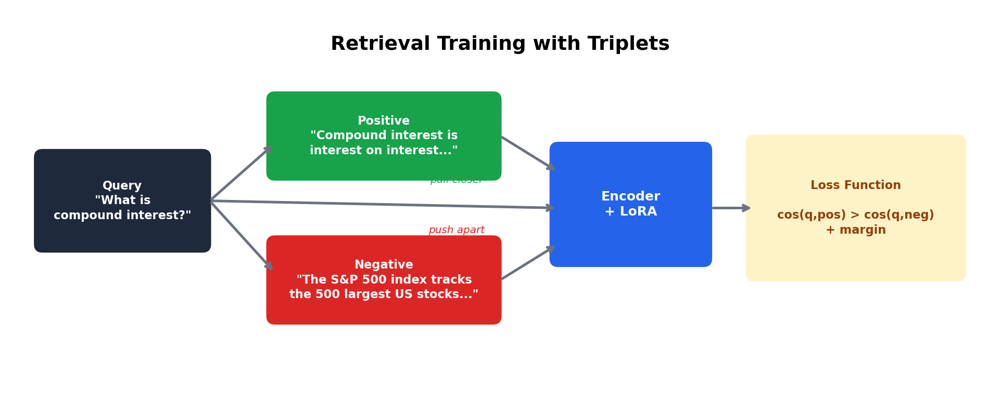
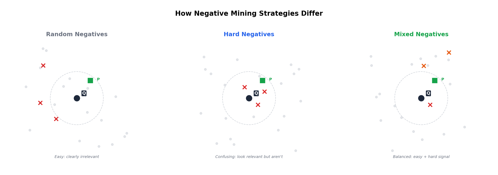
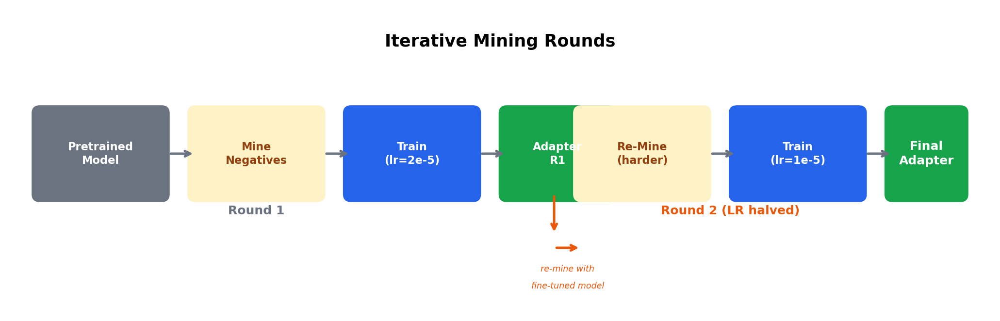
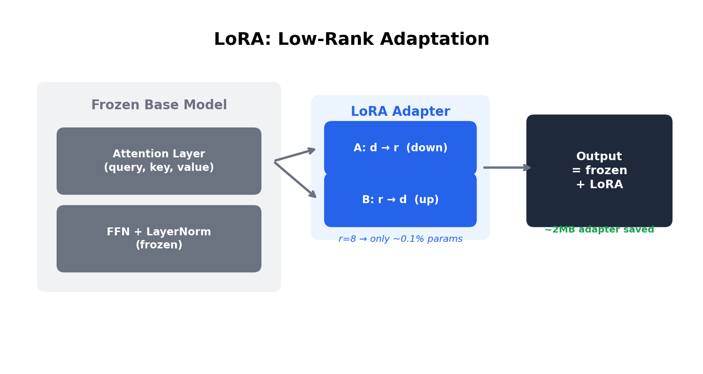
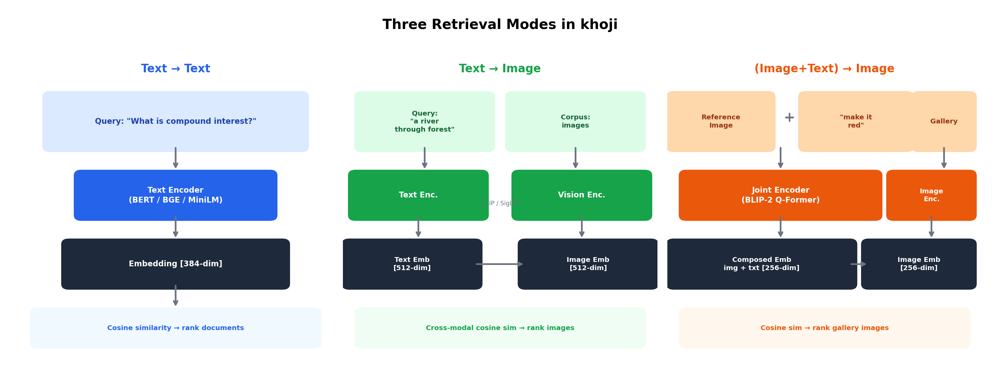
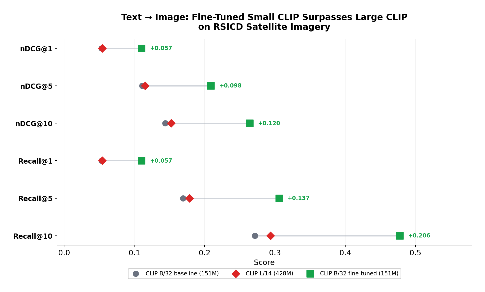
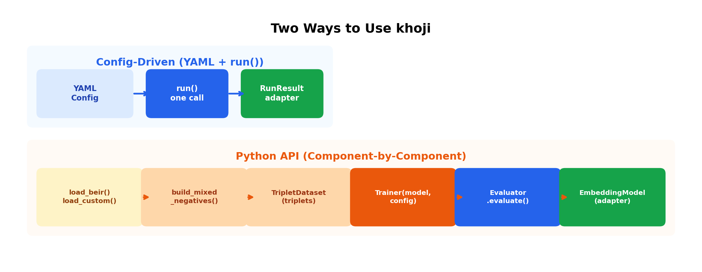

# How to Fine-Tune Retrieval Models with khoji: A Complete Technical Guide

*Everything you need to know to fine-tune text, image, and composed retrieval models — from data preparation to deployment.*

---

## What This Guide Covers

This is a deep technical walkthrough of [khoji](https://github.com/suyashh94/khoji), a Python library for fine-tuning retrieval models using LoRA. We cover every concept, every parameter, and every use case — with code examples showing both the YAML config-driven path and the Python API path.

**What you'll learn:**

- How retrieval model training works (triplets, negative mining, loss functions)
- khoji's three retrieval modes: text-to-text, text-to-image, and composed (image+text to image)
- Two ways to use the library: YAML configs for quick experiments, Python API for full control
- How to bring custom models, custom datasets, custom loss functions, and custom metrics
- Training techniques that matter: mixed negatives, mining rounds, `skip_top`, LoRA rank tuning
- Real experiment results on FiQA, RSICD, and FashionIQ

---

## Part 1: How Retrieval Training Works

### The Core Idea: Learning from Triplets

Retrieval model training is fundamentally different from classification. You don't have fixed classes — you have queries, a corpus, and a notion of which items are relevant to which queries. The training signal comes from **triplets**: (query, relevant item, non-relevant item).



The model learns to push query embeddings closer to relevant items and farther from non-relevant items in the shared embedding space. After training, you find relevant items by encoding the query and finding the nearest neighbors in the embedding space.

### What Makes a Good Negative?

The non-relevant item in the triplet — the **negative** — is the most important training signal. If the negative is too easy (clearly irrelevant), the model learns nothing useful. If it's too hard (actually relevant but mislabeled), training goes backwards.



khoji provides three strategies:

**Random negatives** sample items uniformly from the corpus. They're easy — "this financial document is not about cooking" — but they teach the model basic discrimination. No encoding required, so they're fast.

```yaml
data:
  negatives: random
  n_negatives: 3       # 3 random negatives per (query, positive) pair
```

**Hard negatives** are items the model currently confuses with relevant ones. They're mined by encoding the entire corpus, finding the top-k most similar non-relevant items for each query, and using those as training negatives. This forces the model to learn fine-grained distinctions — "this document about bond yields is not the same as this document about bond ratings."

```yaml
data:
  negatives: hard
  n_negatives: 3
  top_k: 50            # search top-50 results for hard negatives
  skip_top: 5          # skip top 5 — often unlabeled positives (see below)
```

**Mixed negatives** combine both. Random negatives prevent early training collapse; hard negatives push the ranking boundary. This generally gives the best results.

```yaml
data:
  negatives: mixed
  n_random: 2          # 2 random negatives per pair
  n_hard: 1            # 1 hard negative per pair
```

### The `skip_top` Problem

Most retrieval datasets have **incomplete relevance labels**. A document might be perfectly relevant to a query but isn't labeled as such — the annotator simply didn't see it. These unlabeled positives tend to cluster at the top of the model's ranking, because they *are* relevant.

If you mine these as hard negatives, you're training the model to push away good results. `skip_top` addresses this by skipping the N most similar non-relevant items before picking hard negatives:

```yaml
data:
  skip_top: 5          # skip top 5 non-relevant (likely false negatives)
  top_k: 50            # then pick hard negatives from ranks 6-50
```

**Rule of thumb:** `skip_top: 5` for datasets with sparse annotations, `skip_top: 0` for comprehensive ones.

### Iterative Mining Rounds

A single round of hard negative mining uses the pretrained model's understanding. But after training, the model has improved — its notion of "hard" has changed. **Mining rounds** repeat the mine-train cycle:



Each round halves the learning rate to avoid overshooting as negatives get harder. In practice, 2 rounds is the sweet spot — 3+ has diminishing returns.

```yaml
data:
  negatives: mixed
  mining_rounds: 2     # mine → train → re-mine → train
```

### Loss Functions

khoji implements three loss functions. All take the same input: L2-normalized (query, positive, negative) embedding triplets.

**Triplet Margin Loss** — pushes positive and negative apart by a margin:

```
L = mean(relu(cos_dist(q, pos) - cos_dist(q, neg) + margin))
```

Simple, works with small batches. Set `margin: 0.2` (default). Good starting point.

**InfoNCE Loss** — cross-entropy over positive vs. all distractors. Uses in-batch negatives (the other batch items' positives) plus the explicit hard negative. Richer signal, best with larger batches:

```
L = -log(exp(sim(q, pos)/t) / sum(exp(sim(q, all_distractors)/t)))
```

Set `temperature: 0.05` (default). Lower = sharper, more discriminative. Best overall performance.

**Contrastive Loss** — directly maximizes/minimizes cosine similarity:

```
L = mean(-cos_sim(q, pos) + cos_sim(q, neg))
```

No hyperparameters beyond learning rate. Simple baseline.

```yaml
train:
  loss: infonce         # "triplet", "infonce", or "contrastive"
  margin: 0.2           # for triplet loss only
  temperature: 0.05     # for infonce loss only
```

Via the Python API, you can also pass a custom loss function:

```python
def my_loss(query_emb, positive_emb, negative_emb):
    # Any (batch, dim) -> scalar computation
    return ...

config = TrainingConfig(loss_fn=my_loss)
```

### LoRA: Training 0.1% of Parameters



Full fine-tuning updates all model parameters — hundreds of MB of weights. LoRA (Low-Rank Adaptation) instead injects small trainable matrices into the attention layers while keeping everything else frozen.

The key parameters:

| Parameter | What it does | Default | Guidance |
|-----------|-------------|---------|----------|
| `r` | Rank of the low-rank matrices | 8 | Higher = more capacity. 8 for most tasks, 16 for harder domains, 32+ with abundant data. |
| `alpha` | Scaling factor | 16 | Convention: `2 * r`. Higher alpha = stronger LoRA effect. |
| `dropout` | Dropout on LoRA layers | 0.1 | 0.0 for overfit debugging, 0.1 for production. |
| `target_modules` | Which layers to adapt | auto-detect | Usually attention Q/K/V projections. Set explicitly for non-standard architectures. |

```yaml
lora:
  r: 16
  alpha: 32
  dropout: 0.1
  target_modules: null   # auto-detect: query, key, value for BERT; q_proj, k_proj, v_proj for CLIP
```

For full fine-tuning (all parameters trained), set `lora: null`. Use a lower learning rate (1e-5) to avoid catastrophic forgetting.

### Evaluation Metrics

khoji computes three standard IR metrics, all implemented from scratch:

- **nDCG@k** (Normalized Discounted Cumulative Gain) — measures ranking quality, accounting for both relevance grade and position. 1.0 = perfect ranking.
- **MRR@k** (Mean Reciprocal Rank) — 1/position of the first relevant result. Focuses on where the first hit appears.
- **Recall@k** — fraction of all relevant items found in top-k. Measures coverage.

You can also add custom metrics:

```python
def precision_at_k(ranked_doc_ids, qrel, k):
    relevant = {d for d, s in qrel.items() if s > 0}
    return sum(1 for d in ranked_doc_ids[:k] if d in relevant) / k

result = evaluator.evaluate(
    dataset=my_dataset,
    extra_metrics={"precision": precision_at_k},
)
```

---

## Part 2: Three Retrieval Modes



### Mode 1: Text → Text

Fine-tune text embedding models (BERT, BGE, sentence-transformers) for domain-specific document retrieval.

**Models:** Any HuggingFace model compatible with `AutoModel`. Pooling is auto-detected (CLS, mean, max, etc.).

**Dataset format — three options:**

1. **BEIR datasets** (built-in): `load_beir("fiqa")`, `load_beir("scifact")`, etc.

2. **Local files:**
   ```
   my_dataset/
     queries.jsonl   # {"_id": "q1", "text": "What is compound interest?"}
     corpus.jsonl    # {"_id": "d1", "text": "Compound interest is...", "title": "Optional"}
     qrels.tsv       # q1\td1\t1
   ```

3. **Python dicts:**
   ```python
   dataset = RetrievalDataset(
       queries={"q1": "What is compound interest?"},
       corpus={"d1": "Compound interest is...", "d2": "Unrelated."},
       qrels={"q1": {"d1": 1}},
   )
   ```

**Example result (FiQA, MiniLM 22M fine-tuned):**


**Full YAML config:**

```yaml
model:
  name: sentence-transformers/all-MiniLM-L6-v2

data:
  dataset: fiqa
  split: train
  negatives: mixed
  n_random: 2
  n_hard: 1
  mining_rounds: 2

lora:
  r: 16
  alpha: 32
  dropout: 0.1

train:
  epochs: 3
  batch_size: 16
  grad_accum_steps: 4    # effective batch = 64
  lr: 2e-5
  warmup_steps: 50
  loss: infonce
  temperature: 0.05

eval:
  k_values: [1, 5, 10]
  run_before: true
  run_after: true

output_dir: ./output/text-retrieval
```

```python
from khoji import ForgeConfig, run
result = run(ForgeConfig.from_yaml("config.yaml"))
```

**Python API (component-by-component):**

```python
from khoji import (
    EmbeddingModel, Evaluator, Trainer, TrainingConfig,
    TripletDataset, LoRASettings,
    load_beir, build_mixed_negatives,
)

# 1. Load data
dataset = load_beir("fiqa", split="train")

# 2. Mine negatives
model = EmbeddingModel("sentence-transformers/all-MiniLM-L6-v2")
triplets = build_mixed_negatives(dataset, model, n_random=2, n_hard=1, top_k=50)

# 3. Train
config = TrainingConfig(
    epochs=3, batch_size=16, lr=2e-5,
    lora=LoRASettings(r=16, alpha=32),
    save_dir="./my-adapter",
)
trainer = Trainer("sentence-transformers/all-MiniLM-L6-v2", config)
history = trainer.train(TripletDataset(triplets))

# 4. Evaluate
evaluator = Evaluator("sentence-transformers/all-MiniLM-L6-v2", adapter_path="./my-adapter")
result = evaluator.evaluate("fiqa", split="test", k_values=[1, 5, 10])
result.print()

# 5. Inference
model = EmbeddingModel("sentence-transformers/all-MiniLM-L6-v2", adapter_path="./my-adapter")
embeddings = model.encode(["What is compound interest?", "How do bonds work?"])
```

---

### Mode 2: Text → Image

Fine-tune cross-modal models (CLIP, SigLIP) where queries are text and documents are images.

**Models:** CLIP and SigLIP variants from HuggingFace. Auto-detected architecture.

**Additional config:**
- `lora_target`: Which encoder(s) to fine-tune — `"both"`, `"vision"`, or `"text"`
- `cache_dir`: Cache downloaded images locally

**Dataset format:**

```
my_image_dataset/
  queries.jsonl   # {"_id": "q1", "text": "a river through forest"}
  corpus.jsonl    # {"_id": "d1", "image": "images/river.jpg"}  (path or URL)
  qrels.tsv       # q1\td1\t1
```

Or Python:

```python
dataset = MultimodalRetrievalDataset(
    queries={"q1": "a river through forest"},
    corpus={"d1": "images/river.jpg", "d2": "images/city.jpg"},
    qrels={"q1": {"d1": 1}},
    base_dir="./my_dataset",
)
```

**Built-in datasets:** `load_flickr30k()`, `load_rsicd()`

**Example result (RSICD satellite imagery, CLIP fine-tuned):**



**YAML config:**

```yaml
model:
  name: openai/clip-vit-base-patch32
  lora_target: both

data:
  dataset: arampacha/rsicd
  split: train
  negatives: mixed
  n_random: 2
  n_hard: 1
  skip_top: 5
  mining_rounds: 2
  cache_dir: null

lora:
  r: 16
  alpha: 32

train:
  epochs: 3
  batch_size: 16
  grad_accum_steps: 2
  lr: 2e-5
  max_length: 77
  loss: infonce

eval:
  k_values: [1, 5, 10]
  run_before: true
  run_after: true

output_dir: ./output/multimodal
```

```python
from khoji import MultimodalForgeConfig, run_multimodal
result = run_multimodal(MultimodalForgeConfig.from_yaml("config.yaml"))
```

**Python API:**

```python
from khoji import (
    MultimodalEmbeddingModel, MultimodalEvaluator,
    MultimodalTrainer, MultimodalTrainingConfig,
    MultimodalTripletDataset, LoRASettings,
    load_rsicd, build_mixed_negatives_multimodal,
)

dataset = load_rsicd(split="train")
triplets = build_mixed_negatives_multimodal(dataset, model, n_random=2, n_hard=1)

config = MultimodalTrainingConfig(
    epochs=3, batch_size=16, lr=2e-5,
    lora=LoRASettings(r=16, alpha=32),
    lora_target="both",
    save_dir="./my-clip-adapter",
    base_dir=dataset.base_dir,
)
trainer = MultimodalTrainer("openai/clip-vit-base-patch32", config)
history = trainer.train(MultimodalTripletDataset(triplets))
```

---

### Mode 3: (Image + Text) → Image (Composed Retrieval)

Fine-tune joint encoder models (BLIP-2) for composed queries: "here's a reference image, find one that matches this modification."


**Models:** BLIP-2 variants. BLIP-2 has three components: a frozen vision encoder (ViT-G), a Querying Transformer (Q-Former), and a frozen LLM. LoRA targets the Q-Former.

**Dataset format** — each query is an (image, text) pair:

```
my_composed_dataset/
  queries.jsonl   # {"_id": "q1", "image": "ref.jpg", "text": "make it red"}
  corpus.jsonl    # {"_id": "d1", "image": "target.jpg"}
  qrels.tsv       # q1\td1\t1
```

Or Python:

```python
dataset = ComposedRetrievalDataset(
    queries={
        "q1": ("ref_dress.jpg", "make it red"),
    },
    corpus={"d1": "red_dress.jpg", "d2": "other.jpg"},
    qrels={"q1": {"d1": 1}},
    base_dir="./my_dataset",
)
```

**Example result (FashionIQ dress):**


**YAML config:**

```yaml
model:
  name: Salesforce/blip2-itm-vit-g

data:
  dataset: ./data/my_composed_dataset
  negatives: mixed
  n_random: 2
  n_hard: 1

lora:
  r: 8
  alpha: 16

train:
  epochs: 5
  batch_size: 8
  lr: 2e-5
  loss: infonce

eval:
  k_values: [1, 5, 10, 50]
  run_before: true
  run_after: true

output_dir: ./output/composed
```

```python
from khoji import ComposedForgeConfig, run_composed
result = run_composed(ComposedForgeConfig.from_yaml("config.yaml"))
```

**Composed embedding fusion.** The default fuses image and text embeddings by addition: `embedding = img_emb + txt_emb`. For custom fusion, pass your own encode functions to `ComposedTrainer`:

```python
trainer = ComposedTrainer(
    model=my_model,
    encode_query_fn=my_joint_encode,   # (list[PIL], list[str]) -> Tensor
    encode_image_fn=my_image_encode,   # (list[PIL]) -> Tensor
    config=config,
)
```

---

## Part 3: Two Ways to Use khoji



### Config-Driven (YAML + `run()`)

Write a YAML file, call one function. khoji handles everything — data loading, negative mining, LoRA, training, evaluation, saving.

```python
from khoji import ForgeConfig, run

result = run(ForgeConfig.from_yaml("config.yaml"))
# result.history     -> TrainHistory (step_loss, step_lr, epoch_loss, grad_norms)
# result.baseline    -> EvalResult (pre-training metrics)
# result.finetuned   -> EvalResult (post-training metrics)
# result.adapter_dir -> path to saved adapter
```

Three runner functions:
- `run()` for text-to-text
- `run_multimodal()` for text-to-image
- `run_composed()` for composed retrieval

### Python API (Component-by-Component)

Use individual components when you need full control: custom data loading, non-standard mining, programmatic hyperparameter search, or integration with existing pipelines.

Every component is independent:

| Component | Text | Multimodal | Composed |
|-----------|------|------------|----------|
| **Dataset** | `RetrievalDataset` | `MultimodalRetrievalDataset` | `ComposedRetrievalDataset` |
| **Loader** | `load_beir()`, `load_custom()` | `load_flickr30k()`, `load_rsicd()`, `load_custom_multimodal()` | `load_custom_composed()` |
| **Mining** | `build_random_negatives()`, `mine_hard_negatives()`, `build_mixed_negatives()` | `*_multimodal()` variants | `*_composed()` variants |
| **Triplet** | `Triplet`, `TripletDataset` | `MultimodalTriplet`, `MultimodalTripletDataset` | `ComposedTriplet`, `ComposedTripletDataset` |
| **Trainer** | `Trainer` | `MultimodalTrainer` | `ComposedTrainer` |
| **Evaluator** | `Evaluator` | `MultimodalEvaluator` | `ComposedEvaluator` |
| **Model** | `EmbeddingModel` | `MultimodalEmbeddingModel` | `JointEmbeddingModel` |

---

## Part 4: Custom Models and Datasets

### Custom Models (Non-HuggingFace)

Every mode supports custom PyTorch models. You provide an `nn.Module` and encode functions — khoji handles training, evaluation, and LoRA.

The key difference between modes is what the encode functions receive:

| Mode | Encode function inputs |
|------|----------------------|
| Text → Text | Wired automatically from model + tokenizer + pooling |
| Text → Image | `encode_text_fn(list[str])` and `encode_image_fn(list[str])` — receives file paths |
| Composed | `encode_query_fn(list[PIL], list[str])` and `encode_image_fn(list[PIL])` — receives PIL images |

**Text → Text custom model:**

```python
# Model must: forward(input_ids, attention_mask) -> obj with .last_hidden_state
# Tokenizer must support: tokenizer(texts, padding=True, truncation=True, return_tensors="pt")

trainer = Trainer(
    model=my_encoder, tokenizer=my_tokenizer, pooling="mean",
    config=TrainingConfig(epochs=3, lora=None),
)
```

**Text → Image custom model:**

```python
trainer = MultimodalTrainer(
    model=my_clip,
    encode_text_fn=my_text_fn,     # list[str] -> Tensor (batch, dim)
    encode_image_fn=my_image_fn,   # list[str] -> Tensor (batch, dim) ← file paths
    config=MultimodalTrainingConfig(epochs=3, lora=None),
)
```

**Composed custom model:**

```python
trainer = ComposedTrainer(
    model=my_model,
    encode_query_fn=my_joint_fn,   # (list[PIL], list[str]) -> Tensor
    encode_image_fn=my_image_fn,   # list[PIL] -> Tensor ← PIL images directly
    config=ComposedTrainingConfig(epochs=3, lora=None),
)
```

### Custom Datasets

Every dataset is just dicts. Build from any source — CSV, database, API, dataframe:

```python
import pandas as pd

tickets = pd.read_csv("support_tickets.csv")
kb = pd.read_csv("knowledge_base.csv")
labels = pd.read_csv("labels.csv")

dataset = RetrievalDataset(
    queries={str(r.id): r.question for r in tickets.itertuples()},
    corpus={str(r.id): r.content for r in kb.itertuples()},
    qrels={
        str(qid): {str(aid): int(s) for _, aid, s in grp.itertuples()}
        for qid, grp in labels.groupby("ticket_id")
    },
)
```

Training and evaluation datasets are independent — train on one, evaluate on another:

```yaml
data:
  dataset: ./my_train_data
eval:
  dataset: ./my_eval_data     # null = same as data.dataset
```

---

## Part 5: Training Configuration Reference

### Every Parameter Explained

#### `model`

| Parameter | Type | Default | Description |
|-----------|------|---------|-------------|
| `name` | str | `BAAI/bge-base-en-v1.5` | HuggingFace model ID |
| `adapter_path` | str/null | null | Path to existing adapter (for continued training) |
| `dtype` | str/null | null | `"fp16"`, `"bf16"`, or null (fp32). Base model weight precision. |
| `lora_target` | str | `"both"` | Multimodal only: `"vision"`, `"text"`, or `"both"` |

#### `data`

| Parameter | Type | Default | Description |
|-----------|------|---------|-------------|
| `dataset` | str | `fiqa` | BEIR name, HuggingFace dataset, or local directory path |
| `split` | str | `train` | Dataset split |
| `negatives` | str | `random` | `"random"`, `"hard"`, or `"mixed"` |
| `n_negatives` | int | 1 | Negatives per pair (random/hard modes) |
| `n_random` | int | 1 | Random negatives per pair (mixed mode) |
| `n_hard` | int | 1 | Hard negatives per pair (mixed mode) |
| `n_queries` | int/null | null | Subset of queries. null = all. |
| `corpus_size` | int/null | null | Corpus limit for mining. null = all. |
| `top_k` | int | 50 | Top-k for hard negative mining |
| `skip_top` | int | 0 | Skip top N non-relevant (avoids false negatives) |
| `mining_rounds` | int | 1 | Iterative mining rounds. LR halved each round. |
| `cache_dir` | str/null | null | Multimodal: cache downloaded images |

#### `lora`

| Parameter | Type | Default | Description |
|-----------|------|---------|-------------|
| `r` | int | 8 | Rank. Higher = more capacity. |
| `alpha` | int | 16 | Scaling factor. Convention: `2 * r`. |
| `dropout` | float | 0.1 | Dropout on LoRA layers |
| `target_modules` | list/null | null | Auto-detected per architecture |

Set `lora: null` for full fine-tuning.

#### `train`

| Parameter | Type | Default | Description |
|-----------|------|---------|-------------|
| `epochs` | int | 3 | Training epochs |
| `batch_size` | int | 8 | Micro-batch size |
| `grad_accum_steps` | int | 4 | Gradient accumulation. Effective batch = batch_size * grad_accum_steps. |
| `lr` | float | 2e-5 | Learning rate (AdamW) |
| `weight_decay` | float | 0.01 | AdamW weight decay |
| `warmup_steps` | int | 100 | Linear warmup, then linear decay |
| `max_grad_norm` | float | 1.0 | Gradient clipping |
| `max_length` | int | 512 | Max token length |
| `loss` | str | `triplet` | `"triplet"`, `"infonce"`, or `"contrastive"` |
| `margin` | float | 0.2 | For triplet loss |
| `temperature` | float | 0.05 | For InfoNCE loss |
| `mixed_precision` | str/null | null | `"fp16"`, `"bf16"`, or null |
| `overfit_batches` | int/null | null | Debug: train on N batches only |
| `sanity_check_samples` | int | 10 | Check N samples before/after training |
| `save_every_n_steps` | int/null | null | Checkpoint frequency |
| `keep_all_checkpoints` | bool | false | Keep all vs. only latest |

#### `eval`

| Parameter | Type | Default | Description |
|-----------|------|---------|-------------|
| `dataset` | str/null | null | Eval dataset. null = use training dataset. |
| `k_values` | list | [1, 5, 10] | K values for nDCG, MRR, Recall |
| `split` | str | `test` | Eval split |
| `n_queries` | int/null | null | Number of eval queries. null = all. |
| `corpus_size` | int/null | null | Eval corpus size. null = all. |
| `run_before` | bool | true | Evaluate baseline before training |
| `run_after` | bool | true | Evaluate after training |

---

## Part 6: Training Curves and Debugging

### Inspecting Training History

Every training run returns a `TrainHistory` with per-step and per-epoch metrics:

```python
history = trainer.train(dataset)
history.step_loss       # loss per optimizer step
history.step_lr         # learning rate per step
history.step_grad_norm  # gradient L2 norm per step
history.epoch_loss      # average loss per epoch
history.save("train_history.json")
```


### Sanity Check Mode

Before and after training, khoji samples N training triplets and reports cosine similarity metrics:

```
[BEFORE training] Sanity check (10 samples):
    Avg cos_sim(query, pos):  0.4521
    Avg cos_sim(query, neg):  0.4198
    Avg margin (pos - neg):   0.0323
    Samples where pos > neg:  6/10

[AFTER training] Sanity check (10 samples):
    Avg cos_sim(query, pos):  0.7812
    Avg cos_sim(query, neg):  0.2134
    Avg margin (pos - neg):   0.5678
    Samples where pos > neg:  10/10
```

### Overfit Debugging

To verify the pipeline works end-to-end before running a full experiment:

```yaml
train:
  overfit_batches: 1     # train on 1 batch only
  epochs: 50             # many epochs to drive loss to ~0
  lr: 1e-3               # high LR for fast convergence
lora:
  dropout: 0.0           # no dropout
eval:
  run_before: false
  run_after: false
```

The included `_overfit` configs (`minilm_scifact_overfit.yaml`, `clip_rsicd_overfit.yaml`) do exactly this.

---

## Part 7: Output and Deployment

### What's Saved

```
output_dir/
  config.yaml                  # saved config for reproducibility
  train_history.json           # per-step loss, LR, grad norms, per-epoch loss
  adapter/                     # final LoRA adapter
    adapter_model.safetensors  # ~2-4MB
    adapter_config.json
  adapter_r1/                  # round 1 adapter (when mining_rounds > 1)
  baseline.json                # pre-training eval metrics
  finetuned.json               # post-training eval metrics
```

### Loading for Inference

```python
# Text
model = EmbeddingModel("model-name", adapter_path="./adapter")
embeddings = model.encode(["query text"])

# Multimodal
model = MultimodalEmbeddingModel("clip-model", adapter_path="./adapter")
text_emb = model.encode_text(["query"])
img_emb = model.encode_image_sources(["photo.jpg"], base_dir="./images")

# Composed
model = JointEmbeddingModel("blip2-model", adapter_path="./adapter")
query_emb = model.encode(images=[ref_img], texts=["make it red"])
gallery_emb = model.encode(images=gallery_images)
```

### Mining Strategy Impact


---

## Getting Started

```bash
pip install khoji

# Run included configs
khoji configs/minilm_scifact_full.yaml                  # text → text
khoji multimodal configs/clip_rsicd_full.yaml            # text → image

# Composed retrieval (requires FashionIQ data)
python scripts/fashioniq/download_data.py
python scripts/train_composed_retrieval_api.py
```

Four configs are included: `minilm_scifact_full.yaml`, `minilm_scifact_overfit.yaml`, `clip_rsicd_full.yaml`, `clip_rsicd_overfit.yaml`. The `_full` configs run complete training + evaluation. The `_overfit` configs train on a single batch for pipeline verification.

Full documentation, example scripts, and Jupyter notebooks at [github.com/suyashh94/khoji](https://github.com/suyashh94/khoji).
